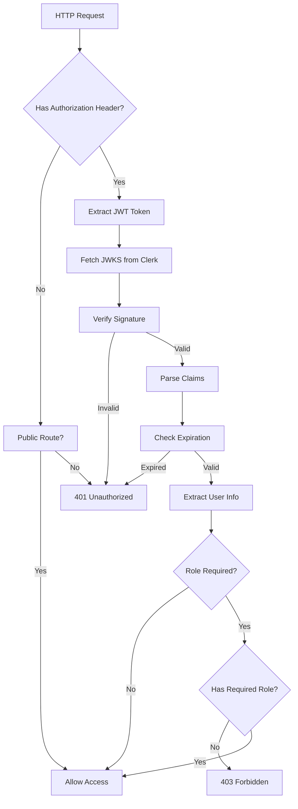

# Security Patterns - Shtetl Zmanim API

**Status:** MANDATORY - All new handlers MUST follow these patterns
**Last Updated:** 2025-12-15
**Epic:** 9 - API Restructuring and Cleanup

---

## Table of Contents

1. [Authentication & Authorization](#authentication--authorization)
2. [Tenant Isolation](#tenant-isolation)
3. [Input Validation](#input-validation)
4. [Error Handling](#error-handling)
5. [SQL Injection Prevention](#sql-injection-prevention)
6. [IDOR Prevention](#idor-prevention)
7. [Rate Limiting](#rate-limiting)
8. [Security Checklist](#security-checklist)

---

## Authentication & Authorization

### Authentication Flow



### Middleware Layers

```go
// 1. RequireAuth - Validates JWT, adds user_id to context
authMiddleware.RequireAuth

// 2. RequireRole - Validates JWT + checks role claim
authMiddleware.RequireRole("publisher")
authMiddleware.RequireRole("admin")

// 3. OptionalAuth - Extracts user info if present, doesn't block
authMiddleware.OptionalAuth
```

### Role Hierarchy

```go
const (
    RoleAdmin     = "admin"     // Full access to all resources
    RolePublisher = "publisher" // Access to own publisher resources
    RoleUser      = "user"      // Read-only access to public data
)

// Admin can access all publisher and user resources
// Publisher can only access their own resources
// User has no write access
```

### Context Keys

```go
const (
    UserIDKey              contextKey = "user_id"              // Clerk user ID
    UserRoleKey            contextKey = "user_role"            // "admin" | "publisher" | ""
    PrimaryPublisherIDKey  contextKey = "primary_publisher_id" // From JWT claims
    PublisherAccessListKey contextKey = "publisher_access_list"// From JWT claims
)

// Retrieve from context
userID := middleware.GetUserID(ctx)
role := middleware.GetUserRole(ctx)
primaryPubID := middleware.GetPrimaryPublisherID(ctx)
accessList := middleware.GetPublisherAccessList(ctx)
```

---

## Tenant Isolation

### Critical Security Function: GetValidatedPublisherID

**SECURITY CRITICAL:** This function prevents tenant isolation vulnerabilities by validating the `X-Publisher-Id` header against JWT claims.

```go
// GetValidatedPublisherID validates and returns the publisher ID from the request
// It checks X-Publisher-Id header first, falls back to primary_publisher_id from JWT
// Returns empty string if user has no access to any publisher
func GetValidatedPublisherID(ctx context.Context, requestedID string) string {
    primaryID := GetPrimaryPublisherID(ctx)
    accessList := GetPublisherAccessList(ctx)
    userRole := GetUserRole(ctx)

    // Admin users can access any publisher
    if userRole == "admin" && requestedID != "" {
        return requestedID
    }

    // If no specific ID requested, use primary
    if requestedID == "" {
        return primaryID
    }

    // Check if requested ID is the primary
    if requestedID == primaryID {
        return requestedID
    }

    // Check if requested ID is in the access list
    for _, id := range accessList {
        if id == requestedID {
            return requestedID
        }
    }

    // Requested ID not in user's access list - return empty (unauthorized)
    slog.Warn("publisher access denied", "requested", requestedID, "primary", primaryID)
    return ""
}
```

### Publisher Resolver Pattern

**BEFORE (VULNERABLE):**
```go
// ❌ CRITICAL VULNERABILITY - Accepts any X-Publisher-Id header without validation
publisherID := r.Header.Get("X-Publisher-Id")
if publisherID == "" {
    RespondBadRequest(w, r, "Missing publisher ID")
    return
}
// User can access ANY publisher by changing header!
```

**AFTER (SECURE):**
```go
// ✅ SECURE - Uses PublisherResolver with JWT validation
pc := h.publisherResolver.MustResolve(w, r)
if pc == nil {
    return // Response already sent (401/404)
}
publisherID := pc.PublisherID
// publisherID is now validated against JWT claims
```

### Tenant Isolation Enforcement

```go
// PublisherResolver.Resolve() MUST validate X-Publisher-Id against JWT
func (pr *PublisherResolver) Resolve(ctx context.Context, r *http.Request) (*PublisherContext, error) {
    userID := middleware.GetUserID(ctx)
    userRole := middleware.GetUserRole(ctx)

    // Extract requested publisher ID
    requestedID := r.Header.Get("X-Publisher-Id")
    if requestedID == "" {
        requestedID = r.URL.Query().Get("publisher_id")
    }

    // ✅ CRITICAL: Validate against JWT claims
    validatedID := middleware.GetValidatedPublisherID(ctx, requestedID)
    if validatedID == "" && requestedID != "" {
        // User tried to access publisher they don't have access to
        return nil, fmt.Errorf("access denied to publisher %s", requestedID)
    }

    // If no requested ID, fall back to primary from JWT
    if validatedID == "" {
        validatedID = middleware.GetPrimaryPublisherID(ctx)
    }

    return &PublisherContext{
        PublisherID: validatedID,
        UserID:      userID,
        UserRole:    userRole,
        IsAdmin:     userRole == "admin",
    }, nil
}
```

---

## Input Validation

### Validation Layers

```go
// 1. Type validation (automatic via JSON unmarshal)
var req CreateZmanRequest
if err := json.NewDecoder(r.Body).Decode(&req); err != nil {
    RespondBadRequest(w, r, "Invalid request body")
    return
}

// 2. Required field validation
if req.ZmanKey == "" {
    RespondValidationError(w, r, "zman_key is required", map[string]string{
        "zman_key": "This field is required",
    })
    return
}

// 3. Business rule validation
if len(req.ZmanKey) > 50 {
    RespondValidationError(w, r, "zman_key too long", map[string]string{
        "zman_key": "Maximum 50 characters",
    })
    return
}

// 4. Referential integrity validation (check FK exists)
exists, err := h.db.Queries.CheckMasterZmanExists(ctx, req.MasterZmanID)
if err != nil || !exists {
    RespondValidationError(w, r, "Invalid master zman reference", nil)
    return
}
```

### URL Parameter Validation

```go
// Always validate URL parameters
idStr := chi.URLParam(r, "id")
id, err := strconv.ParseInt(idStr, 10, 32)
if err != nil || id <= 0 {
    RespondBadRequest(w, r, "Invalid ID parameter")
    return
}
```

### Query Parameter Validation

```go
// Validate optional query params
latStr := r.URL.Query().Get("latitude")
if latStr != "" {
    lat, err := strconv.ParseFloat(latStr, 64)
    if err != nil || lat < -90 || lat > 90 {
        RespondValidationError(w, r, "Invalid latitude", map[string]string{
            "latitude": "Must be between -90 and 90",
        })
        return
    }
}
```

---

## Error Handling

### Generic Error Messages (Security Requirement)

**NEVER expose:**
- Stack traces
- Database error messages
- Internal system details
- File paths
- SQL queries

**ALWAYS use generic messages:**

```go
// ❌ FORBIDDEN - Exposes database internals
if err != nil {
    RespondInternalError(w, r, fmt.Sprintf("Database error: %v", err))
}

// ✅ REQUIRED - Generic message, log details
if err != nil {
    slog.Error("failed to create zman", "error", err, "publisher_id", publisherID)
    RespondInternalError(w, r, "Failed to create zman")
}
```

### "Not Found" for Unauthorized Access

**Security principle:** Don't reveal resource existence to unauthorized users

```go
// ❌ FORBIDDEN - Reveals that resource exists
zman, err := h.db.Queries.GetPublisherZman(ctx, id)
if err != nil {
    RespondInternalError(w, r, "Database error")
    return
}
if zman.PublisherID != publisherID {
    RespondForbidden(w, r, "You don't have access to this zman")
    return
}

// ✅ REQUIRED - Generic "not found" hides existence
zman, err := h.db.Queries.GetPublisherZmanWithAccess(ctx, sqlcgen.Params{
    ID:          id,
    PublisherID: publisherID,
})
if err == pgx.ErrNoRows {
    RespondNotFound(w, r, "Zman not found")
    return
}
if err != nil {
    slog.Error("failed to get zman", "error", err)
    RespondInternalError(w, r, "Failed to retrieve zman")
    return
}
```

### Response Helpers

```go
// Standard response helpers (response.go)
RespondJSON(w, r, http.StatusOK, data)                     // 200 OK
RespondBadRequest(w, r, "message")                         // 400
RespondValidationError(w, r, "message", details)           // 400 with details
RespondUnauthorized(w, r, "message")                       // 401
RespondForbidden(w, r, "message")                          // 403
RespondNotFound(w, r, "message")                           // 404
RespondConflict(w, r, "message")                           // 409
RespondRateLimited(w, r, retryAfterSeconds)                // 429
RespondInternalError(w, r, "message")                      // 500
RespondServiceUnavailable(w, r, "message")                 // 503
```

---

## SQL Injection Prevention

### SQLc - Parameterized Queries ONLY

**MANDATORY:** All database queries MUST use SQLc generated code.

```sql
-- queries/zmanim.sql
-- name: GetPublisherZman :one
SELECT * FROM publisher_zmanim
WHERE id = $1 AND publisher_id = $2 AND deleted_at IS NULL;

-- name: UpdatePublisherZman :one
UPDATE publisher_zmanim
SET hebrew_name = $1,
    english_name = $2,
    formula_dsl = $3,
    updated_at = now()
WHERE id = $4 AND publisher_id = $5 AND deleted_at IS NULL
RETURNING *;
```

```go
// Generated SQLc code (safe)
zman, err := h.db.Queries.GetPublisherZman(ctx, sqlcgen.GetPublisherZmanParams{
    ID:          id,
    PublisherID: publisherID,
})
```

### FORBIDDEN Patterns

```go
// ❌ FORBIDDEN - Raw SQL with string concatenation
query := fmt.Sprintf("SELECT * FROM publisher_zmanim WHERE id = %d", id)
db.Exec(ctx, query)

// ❌ FORBIDDEN - Raw SQL with format strings
query := fmt.Sprintf("SELECT * FROM users WHERE email = '%s'", email)
db.Query(ctx, query)

// ❌ FORBIDDEN - Direct db.Exec/db.Query in handlers
db.Exec(ctx, "UPDATE publishers SET name = $1 WHERE id = $2", name, id)
```

### REQUIRED Pattern

```go
// ✅ REQUIRED - SQLc generated code only
result, err := h.db.Queries.UpdatePublisher(ctx, sqlcgen.UpdatePublisherParams{
    Name: name,
    ID:   id,
})
```

---

## IDOR Prevention

### Insecure Direct Object Reference (IDOR)

**Vulnerability:** User modifies URL parameter to access another user's resource.

### Prevention Pattern

**ALWAYS include publisher_id/user_id filter in queries:**

```sql
-- ❌ VULNERABLE - No publisher_id filter
-- name: GetZman :one
SELECT * FROM publisher_zmanim WHERE id = $1;

-- ✅ SECURE - Filters by publisher_id
-- name: GetZman :one
SELECT * FROM publisher_zmanim
WHERE id = $1 AND publisher_id = $2 AND deleted_at IS NULL;
```

```go
// ❌ VULNERABLE - Accepts URL param without tenant check
id := chi.URLParam(r, "id")
zman, err := h.db.Queries.GetZman(ctx, id)

// ✅ SECURE - Filters by authenticated publisher
pc := h.publisherResolver.MustResolve(w, r)
if pc == nil { return }
zman, err := h.db.Queries.GetZman(ctx, sqlcgen.GetZmanParams{
    ID:          id,
    PublisherID: pc.PublisherID,
})
```

### Cross-Publisher Resource Access

```go
// Some resources allow cross-publisher access (e.g., public algorithms)
// These MUST explicitly check permissions

func (h *Handlers) GetPublicAlgorithm(w http.ResponseWriter, r *http.Request) {
    id := chi.URLParam(r, "id")

    // Check if algorithm is public
    alg, err := h.db.Queries.GetAlgorithm(ctx, id)
    if err != nil {
        RespondNotFound(w, r, "Algorithm not found")
        return
    }

    // ✅ SECURE - Explicitly check public flag
    if !alg.IsPublic {
        RespondNotFound(w, r, "Algorithm not found")
        return
    }

    RespondJSON(w, r, http.StatusOK, alg)
}
```

---

## Rate Limiting

### Public API Rate Limiting

```go
// In-memory rate limiter for public routes
r.Group(func(r chi.Router) {
    r.Use(authMiddleware.OptionalAuth)
    r.Use(rateLimiter.Middleware)  // 60 req/min for anonymous, 300 for authenticated

    r.Get("/publishers", h.GetPublishers)
    r.Get("/zmanim", h.GetZmanimForCity)
})
```

### External API Rate Limiting (Redis-backed)

```go
// Redis-backed rate limiter for M2M API
r.Route("/external", func(r chi.Router) {
    r.Use(m2mAuth.RequireM2M)
    r.Use(externalRateLimiter.Middleware)  // 10 req/min, 100 req/hour per client_id

    r.Post("/zmanim/calculate", h.CalculateExternalBulkZmanim)
})
```

---

## Security Checklist

### New Handler Checklist

- [ ] **Authentication**
  - [ ] Route uses appropriate middleware (`RequireAuth`, `RequireRole`, or `OptionalAuth`)
  - [ ] User ID retrieved from context, not request body/headers
  - [ ] Role checked before privileged operations

- [ ] **Authorization/Tenant Isolation**
  - [ ] Uses `PublisherResolver.MustResolve()` for publisher endpoints
  - [ ] Does NOT blindly trust `X-Publisher-Id` header
  - [ ] Admin-only endpoints use `RequireRole("admin")`
  - [ ] Cross-publisher access explicitly checked

- [ ] **Input Validation**
  - [ ] Request body parsed and validated
  - [ ] URL parameters validated (type, range, format)
  - [ ] Query parameters validated if used
  - [ ] Foreign key references validated (existence check)

- [ ] **SQL Injection Prevention**
  - [ ] ONLY uses SQLc generated queries
  - [ ] NO raw SQL (db.Exec, db.Query, fmt.Sprintf with SQL)
  - [ ] NO string concatenation in queries
  - [ ] All parameters passed via SQLc params struct

- [ ] **IDOR Prevention**
  - [ ] Queries filter by publisher_id/user_id
  - [ ] URL parameter IDs validated against user's access
  - [ ] Generic "not found" for unauthorized access
  - [ ] No data leakage in error messages

- [ ] **Error Handling**
  - [ ] Generic error messages for 500s
  - [ ] No stack traces in responses
  - [ ] No database error details exposed
  - [ ] Errors logged with slog (not returned to client)
  - [ ] "Not found" instead of "forbidden" for non-existent resources

- [ ] **Rate Limiting**
  - [ ] Public routes use rate limiter middleware
  - [ ] External API routes use Redis-backed rate limiter
  - [ ] Rate limit headers set correctly

### Code Review Security Questions

1. Can a user access another user's data by changing URL parameters?
2. Can a publisher access another publisher's data by changing `X-Publisher-Id` header?
3. Are database errors exposed to the client?
4. Are SQL queries parameterized (SQLc) or constructed with string concatenation?
5. Does the handler validate all inputs (body, URL params, query params)?
6. Are admin-only operations protected by `RequireRole("admin")`?
7. Does the error message reveal whether a resource exists?
8. Is user authentication checked before database queries?

---

## Attack Scenarios & Mitigations

### Scenario 1: Publisher ID Tampering

**Attack:** User changes `X-Publisher-Id` header to access another publisher's zmanim.

```http
GET /api/v1/publisher/zmanim
Authorization: Bearer <token for publisher 123>
X-Publisher-Id: 456
```

**Vulnerable Code:**
```go
publisherID := r.Header.Get("X-Publisher-Id")  // Accepts 456 without validation
zmanim, _ := h.db.Queries.GetPublisherZmanim(ctx, publisherID)  // Returns publisher 456's data!
```

**Mitigation:**
```go
pc := h.publisherResolver.MustResolve(w, r)
if pc == nil { return }  // MustResolve validates against JWT claims
zmanim, _ := h.db.Queries.GetPublisherZmanim(ctx, pc.PublisherID)  // Safe
```

### Scenario 2: IDOR via URL Parameter

**Attack:** User changes URL parameter to access another user's resource.

```http
DELETE /api/v1/publisher/zmanim/789
Authorization: Bearer <token for publisher 123>
X-Publisher-Id: 123
```

If zman 789 belongs to publisher 456, can publisher 123 delete it?

**Vulnerable Code:**
```go
id := chi.URLParam(r, "id")
h.db.Queries.DeleteZman(ctx, id)  // Deletes ANY zman!
```

**Mitigation:**
```go
id := chi.URLParam(r, "id")
pc := h.publisherResolver.MustResolve(w, r)
if pc == nil { return }
err := h.db.Queries.DeleteZman(ctx, sqlcgen.DeleteZmanParams{
    ID:          id,
    PublisherID: pc.PublisherID,  // Filter by publisher
})
if err == pgx.ErrNoRows {
    RespondNotFound(w, r, "Zman not found")  // Generic message
}
```

### Scenario 3: SQL Injection

**Attack:** User submits malicious SQL in request body.

```json
{
  "zman_key": "sunrise'; DROP TABLE publisher_zmanim; --"
}
```

**Vulnerable Code:**
```go
query := fmt.Sprintf("SELECT * FROM publisher_zmanim WHERE zman_key = '%s'", req.ZmanKey)
db.Exec(ctx, query)  // SQL injection!
```

**Mitigation:**
```go
// SQLc parameterized query (immune to injection)
zman, err := h.db.Queries.GetZmanByKey(ctx, sqlcgen.GetZmanByKeyParams{
    ZmanKey:     req.ZmanKey,
    PublisherID: publisherID,
})
```

### Scenario 4: Information Disclosure via Errors

**Attack:** User probes for resource existence via error messages.

```http
GET /api/v1/publisher/zmanim/999
Authorization: Bearer <token for publisher 123>
X-Publisher-Id: 123
```

**Vulnerable Code:**
```go
zman, err := h.db.Queries.GetZman(ctx, id, publisherID)
if err == pgx.ErrNoRows {
    RespondNotFound(w, r, "Zman not found")
}
// But if zman exists for different publisher:
if zman.PublisherID != publisherID {
    RespondForbidden(w, r, "Access denied")  // Reveals it exists!
}
```

**Mitigation:**
```go
// Single query with publisher filter
zman, err := h.db.Queries.GetZman(ctx, sqlcgen.GetZmanParams{
    ID:          id,
    PublisherID: publisherID,
})
if err == pgx.ErrNoRows {
    RespondNotFound(w, r, "Zman not found")  // Same message whether it doesn't exist or belongs to another publisher
    return
}
```

---

## References

- **Middleware:** `api/internal/middleware/auth.go`
- **Publisher Resolver:** `api/internal/handlers/publisher_context.go`
- **Response Helpers:** `api/internal/handlers/response.go`
- **Coding Standards:** `docs/coding-standards.md`
- **OWASP Top 10:** https://owasp.org/www-project-top-ten/

---

**Last Updated:** 2025-12-15 (Story 9.4)
**Maintainer:** Security Team
**Review Frequency:** Quarterly
